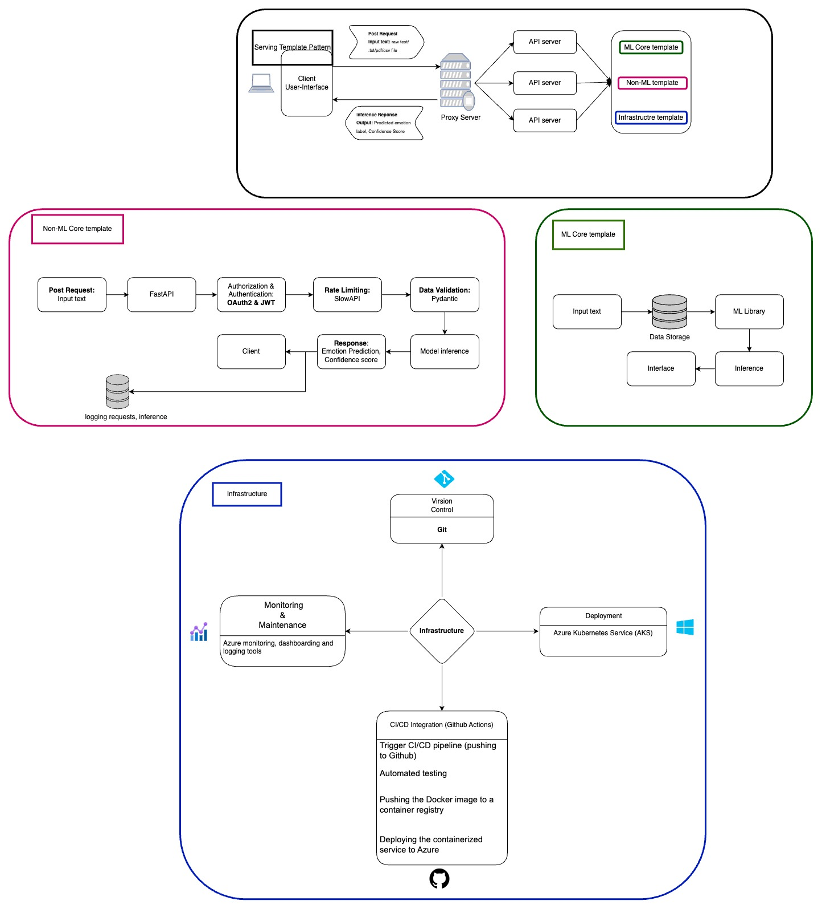

# Sentiment Analysis on Movie Reviews

## Overview

This project, **Sentiment Analysis on Movie Reviews**, is part of the MLOps course in the **AMMI (African Master's in Machine Intelligence)** program. The goal of this project is to automatically detect sentiments (positive or negative) from movie reviews using a custom-built sentiment analysis model. The system assists production companies and marketing teams in understanding public sentiment about movies, allowing for data-driven marketing strategies and user engagement.

## Table of Contents

- [Project Description](#project-description)
- [Key Features](#key-features)
- [Architecture Overview](#architecture-overview)
- [Setup & Installation](#setup--installation)
- [Running the Application](#running-the-application)
- [API Endpoints](#api-endpoints)
- [Tests](#tests)
- [Cloud Services](#cloud-services)
- [Contributors](#contributors)

## Project Description


### Objectives

- Classify movie reviews into positive or negative.
- Provide batch and real-time sentiment analysis for movie reviews.
- Deploy the solution to the cloud for scalability and real-time access.
- Offer a user-friendly interface for submitting and visualizing predictions.
- Log predictions and performance metrics for continuous monitoring and improvement.

### Development Overview

This project was **developed from scratch** using the **LSTM (Long Short-Term Memory)** architecture for the sentiment analysis model. The model was trained on the **IMDB movie reviews dataset**, which contains positive and negative sentiments. Multiple experiments were conducted to fine-tune the model by trying different hyperparameters, architectures, and training strategies to optimize performance for accurate sentiment detection.

## Key Features

- **Custom-Built Sentiment Analysis Model**: Developed from scratch using the LSTM architecture, trained and fine-tuned on the IMDB dataset.
- **Batch and Real-Time Inference**: Supports both real-time predictions and batch processing for large datasets.
- **OAuth2 Authentication**: Secures API access using OAuth2 and JWT tokens.
- **Logging and Monitoring**: Logs prediction details and system metrics to Azure Blob Storage.
- **Cloud-Based Deployment**: Deployed on Microsoft Azure.

## Architecture Overview

### System Design
This system design follows the [Serving Template Pattern](https://github.com/mercari/ml-system-design-pattern/blob/master/Serving-patterns/Serving-template-pattern/design_en.md) for scalable sentiment analysis of movie reviews. It structures the project into an ML Core for data pipeline and model inference, Non-ML Core for API handling, authentication, and data validation, and Infrastructure for CI/CD deployment. The architecture enables real-time and batch processing with logging, monitoring, and automated retraining, ensuring efficient handling of large volumes of movie reviews.



## Setup & Installation

### Prerequisites

Ensure you have the following installed:

- Python 3.8+
- Azure account with access to Blob Storage
- Docker 

### Clone the Repository

```bash
git clone https://github.com/your-username/sentiment-analysis-movie-reviews.git
cd sentiment-analysis-movie-reviews

### Create a Virtual Environment
```bash
python -m venv venv
source venv/bin/activate  # On Windows, use `venv\Scripts\activate`
```

### Install Dependencies

```bash
pip install -r requirements.txt
```

### Environment Variables

Create a .env file in the root directory and configure the following:
```bash
AZURE_CONNECTION_STRING="<your_azure_blob_storage_connection_string>"
AZURE_APP_INSIGHTS_INSTRUMENTATION_KEY="<your_app_insights_key>"
MODEL_URL="<url_to_pretrained_model_in_azure_blob>"
TOKENIZER_URL="<url_to_tokenizer_in_azure_blob>"
EMBEDDING_URL="<url_to_embedding_matrix_in_azure_blob>"
USER_NAME="<default_username>"
PASSWORD="<default_password>"
SECRET_KEY="<your_jwt_secret_key>"
ALGORITHM="HS256"
ACCESS_TOKEN_EXPIRE_MINUTES=30
``` 

### Running the Application

#### Running Locally

To run the FastAPI application locally, execute the following command:
```bash
uvicorn app.app:app --reload
``` 

To run the Streamlit application for the user interface, use the following command:
```bash
streamlit run UI/streamlit_app.py
``` 


#### API Endpoints
To interact with the app:
- Authentication (POST /token): Authenticate and obtain a JWT token.
- Prediction (POST /predict): Predict the sentiment of a product review.
- Health Check (GET /health): Check if the API is running and the model is loaded.


#### Docker Deployment

To build and run the application with Docker, use the following commands:
```bash
docker build -t sentiment-analysis-app .
docker run -p 8000:8000 emotion-detection-app
``` 

### Tests

Unit tests for the key functionalities (model loading, authentication, sentiment prediction, etc.) are located in the tests/ directory. To run the tests, execute:
```bash
pytest 
``` 


### Contributors
For any question or suggestions feel free to reach out :
- [Ahmed Abdalla](aabdalla@aimsammi.org)
- [Duaa Alshareif](dalshareif@aimsammi.org)
- [Ouraga Aime ](oballou@aimsammi.org)

